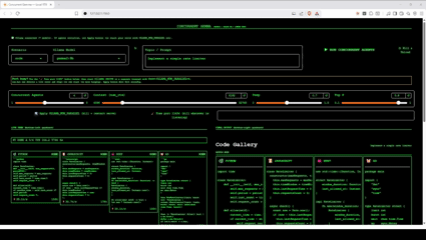

# Concurrent Gemma — Local RTX Edition

<p align="center">
  
</p>

> **This is a fork / local adaptation** of the excellent concurrent multi-agent demo from the official Google Gemma Cookbook:
>
> Original: https://github.com/google-gemma/cookbook/tree/main/apps/concurrent
>
> A full demo video is also included: [concurrent-gemma.mp4](concurrent-gemma.mp4)

**A Windows-first, Gradio + Ollama adaptation** for running multiple Gemma agents (9B/27B) in true parallel using a local Ollama server.

## Requirements

- **OS**: Windows 10/11 (primary target; PowerShell + CMD support)
- **Python**: 3.10 or newer
- **Ollama**: Latest version installed ([ollama.com](https://ollama.com))
  - Recommended models: `gemma2:9b` or `gemma2:27b` (pull with `ollama pull gemma2:9b`)
  - Other models work but performance and concurrency may vary
- **Hardware**: NVIDIA RTX GPU recommended (16 GB+ VRAM ideal for 3–4 agents at 8k–16k context)
- **Dependencies**: See [requirements.txt](requirements.txt) (mainly `gradio` and `ollama` Python client)

For best results with multiple agents:
```powershell
$env:OLLAMA_NUM_PARALLEL = "4"
```

## Quickstart

### 1. Install Prerequisites

```powershell
# 1. Install Ollama from https://ollama.com (if not already)
ollama --version

# 2. Pull a Gemma model (recommended)
ollama pull gemma2:9b
# or for bigger model:
ollama pull gemma2:27b

# 3. (Optional but recommended for concurrency) Set parallelism before starting Ollama
$env:OLLAMA_NUM_PARALLEL = "4"
ollama serve   # Run this in a separate terminal if managing manually
```

### 2. Run the App

**Easiest (recommended on Windows):**

```powershell
# Double-click run.bat or from terminal:
.\run.bat
```

`run.bat` will:
- Detect if Ollama is already running (and respect it)
- Create/activate venv
- Install dependencies
- Launch the Gradio dashboard

**Manual way:**

```powershell
python -m venv .venv
.\.venv\Scripts\activate
pip install -r requirements.txt
python app.py
```

The dashboard will open automatically in your browser at `http://127.0.0.1:7860` (or next available port).

### 3. Use It

1. Select a **Scenario** (code, explanations, translate, ascii, fractals)
2. Enter a **Topic / Prompt**
3. Adjust **Concurrent Agents**, Context, Temp, Top P
4. Click **▶ RUN CONCURRENT AGENTS**
5. Watch **live partial text** streaming in real time in the Live Feed
6. When finished, enjoy the beautiful final **Tailwind gallery**

## Features

- **Gradio web dashboard** — single localhost app (no Terminal grid hell on Windows)
- **Full live partial text** — every agent streams its output as it generates
- **Tailwind-powered cards** — consistent modern dark aesthetic (NVIDIA/Windows vibe)
- **Five ready scenarios**:
  - SVG / Fractal Art Gallery
  - Translation Grid
  - Code Gallery (multi-language)
  - ASCII Art Gallery
  - Multiple Explanations
- Easy to extend with new scenarios
- Hardware-aware defaults (toggleable)

## Controls & Hardware Sizing

| Setting          | Recommended (16 GB VRAM) | Range          | Notes |
|------------------|--------------------------|----------------|-------|
| Concurrent Agents | **3–4**                 | 1–8            | 27B models → max ~3 agents for best speed |
| Context (num_ctx) | **8192–16384**          | 4k–32k         | Higher uses more VRAM |
| Temperature      | **0.7**                 | 0.0–1.5        | Lower = more deterministic |
| Top P            | **0.9**                 | 0.1–1.0        | Nucleus sampling |

**Tip**: Use the **🧹 Free port 11434** button in the UI if you get bind errors, or let `run.bat` manage Ollama automatically.

## Architecture (fork notes)

This is a faithful but adapted port:

- **Planning** — one LLM call decomposes the topic into per-agent instructions (exactly like the original)
- **Concurrent specialists** — run via `ThreadPoolExecutor` + true streaming callbacks
- **Live UI** — frequent generator yields update Tailwind HTML cards in real time
- **Final output** — reuses the original `build_page` Tailwind gallery logic

Communication that used to happen via `.agent_comms/` JSON files is now pure in-memory for the single-process Gradio app.

## Adding a New Scenario

Edit `scenarios.py` following the existing pattern (see the big comment block at the top of the file). The original cookbook has great guidance.

## Future / Optional

- llama.cpp server backend (OpenAI-compatible)
- More advanced concurrency (multiple Ollama instances, etc.)
- Export results, video recording of the run, etc.

## Troubleshooting

### "bind: Only one usage of each socket address" (port 11434 already in use)

This happens when something (previous `ollama serve`, Ollama Desktop, or a run from `run.bat`) is still listening on port 11434.

**From PowerShell (or CMD):**

```powershell
# 1. Find what's using the port
netstat -ano | findstr :11434

# PowerShell version (shows process name + PID)
Get-NetTCPConnection -LocalPort 11434 -State Listen -ErrorAction SilentlyContinue |
  Select-Object LocalPort, OwningProcess, @{n='Name';e={(Get-Process -Id $_.OwningProcess -ErrorAction SilentlyContinue).ProcessName}}

# 2. Kill it (replace 12345 with the actual PID, or kill by name)
taskkill /F /PID 12345 /T
taskkill /F /IM ollama.exe /T
taskkill /F /IM "Ollama Desktop.exe" /T

# 3. Then start your own with the desired parallelism
$env:OLLAMA_NUM_PARALLEL = "4"
ollama serve
```

**In the app:**

- The red status banner on load now suggests the netstat commands.
- Use the **"Apply OLLAMA_NUM_PARALLEL ..."** button — it also does PID-based port freeing before restarting the serve.
- `run.bat` now attempts to detect and kill the port owner before it starts its own minimized serve.

After freeing the port, `run.bat` will detect your manual `ollama serve` and skip its own start (no more pending wait).

### Agents serialize (only 1 running at a time)

Make sure `OLLAMA_NUM_PARALLEL` was set **before** the `ollama serve` process started.
Use the Apply button or restart the serve after setting the variable.

## Credits & Lineage

**Original work:**
- Multi-agent demo, scenarios, planning prompts, and rendering approach:  
  [google-gemma/cookbook/tree/main/apps/concurrent](https://github.com/google-gemma/cookbook/tree/main/apps/concurrent) (Apache-2.0)

**This adaptation:**
- Gradio web UI with live streaming cards
- Local Ollama backend (optimized for Windows + RTX)
- `run.bat` launcher with smart Ollama management
- Matrix/dark theme + Tailwind cards
- Robust port handling and parallelism controls

I will credit the original publicly when sharing on X / LinkedIn.

This project is MIT licensed (see LICENSE). The original Google Gemma Cookbook content remains under its original license.

## License

MIT License — see the [LICENSE](LICENSE) file for details.

---

Enjoy building with multiple minds at once! 🚀
